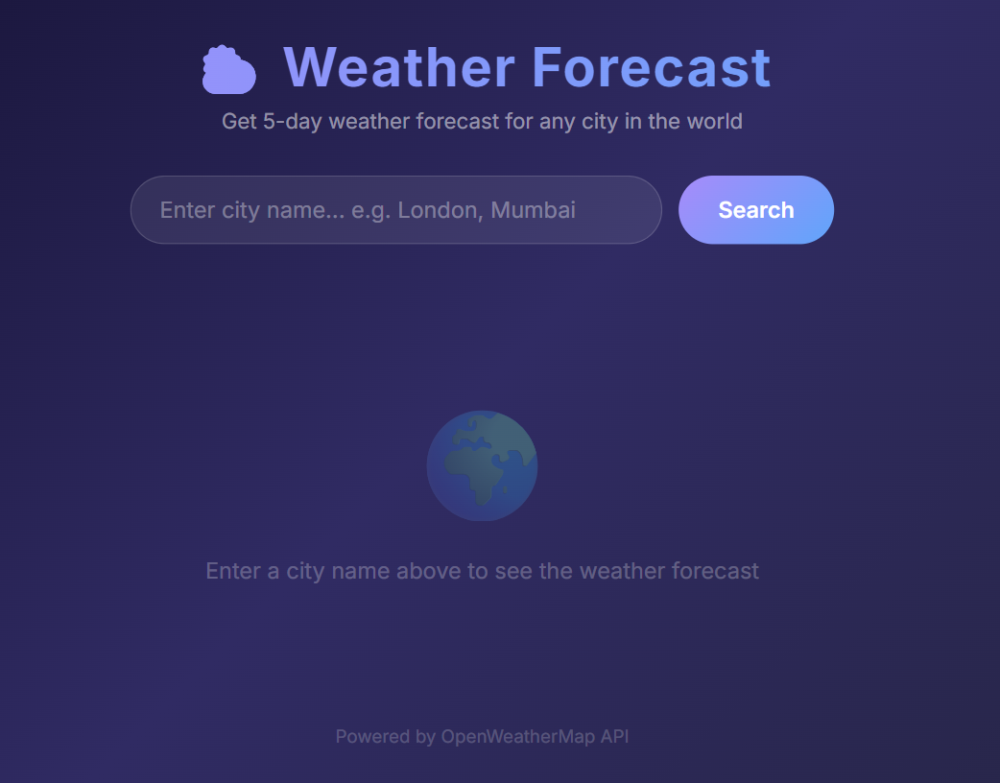
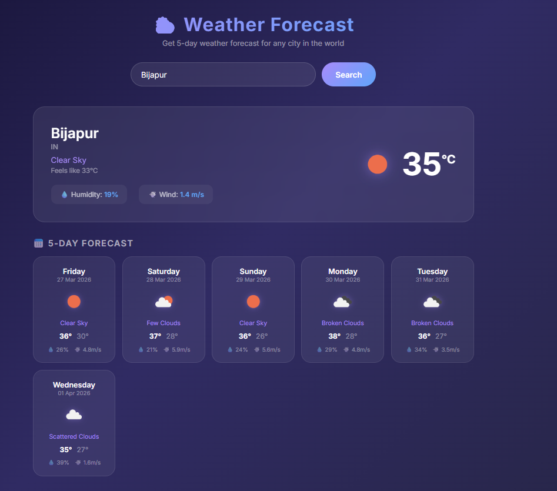
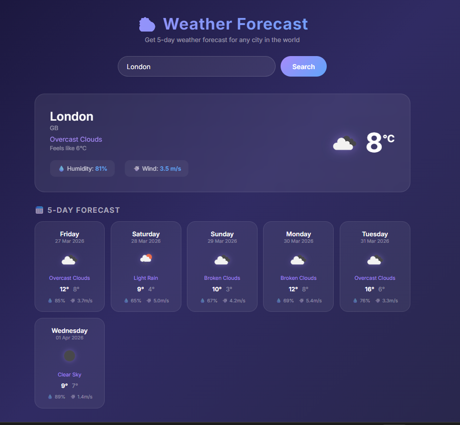

# Weather Forecast App 🌤️

A web application that gives you real-time weather and a 5-day forecast 
for any city in the world.

A full-stack weather forecast application built with Java Spring Boot 3.
Designed with a clean layered architecture — Controller, Service and DTO pattern
consuming the OpenWeatherMap REST API in real time.
---

## Screenshots

### Home Page


### Weather Forecast — India (Bijapur)


### Weather Forecast — Global (London)


---

## What this app does

- Search any city in the world by name
- See the current temperature and what it feels like
- View humidity percentage and wind speed
- Get a full 5-day weather forecast grouped by day
- Shows weather icons for each day
- Handles wrong city names with a friendly error message

---

## Technologies I used

- **Java 21** — main programming language
- **Spring Boot 3** — backend framework
- **Thymeleaf** — frontend templating engine (like Django templates)
- **RestTemplate** — to call the OpenWeatherMap API
- **Jackson** — to map JSON response to Java objects
- **Lombok** — to write cleaner Java code without boilerplate
- **Maven** — build and dependency management
- **OpenWeatherMap API** — real-time weather data

---

## Project Structure
```
weather-springboot/
│
├── src/main/java/com/weather/app/
│   ├── config/
│   │   └── AppConfig.java            → RestTemplate bean
│   ├── controller/
│   │   └── WeatherController.java    → handles web requests
│   ├── dto/
│   │   ├── WeatherApiResponse.java   → maps raw JSON from API
│   │   ├── WeatherResponse.java      → final model for UI
│   │   └── DailyForecast.java        → one day forecast data
│   ├── exception/
│   │   └── WeatherException.java     → custom error handling
│   ├── service/
│   │   └── WeatherService.java       → all API logic here
│   └── WeatherAppApplication.java    → entry point
│
├── src/main/resources/
│   ├── templates/
│   │   └── index.html                → Thymeleaf UI template
│   └── application.properties        → config and API key
│
└── pom.xml                           → Maven dependencies
```

---

## How to run this project locally

Make sure you have **Java 17** and **Maven** installed on your computer.
```bash
# Step 1 - Clone the repository
git clone https://github.com/vijayalaxmi168/Weather-Forecast.git

# Step 2 - Go into the project folder
cd Weather-Forecast

# Step 3 - Run the application
mvn spring-boot:run
```

Then open your browser and visit 👉 **http://localhost:8080**

---

## API Used

This app uses the free [OpenWeatherMap 5-day Forecast API](https://openweathermap.org/forecast5).

It returns weather data every 3 hours for the next 5 days.
I group all the 3-hour slots by date to show one clean card per day.

---

## What I learned building this

- How to structure a Spring Boot project professionally
  (Controller → Service → DTO pattern)
- How to call an external REST API using RestTemplate
- How to automatically map JSON to Java classes using Jackson and @JsonProperty
- How Thymeleaf syntax works compared to Django templates
- How Lombok reduces boilerplate with @Data, @Builder, @Slf4j
- How to handle exceptions properly instead of returning error dicts
- How to externalise configuration using application.properties
- How to push a project to GitHub

## How this project grew

I built this during my MCA and kept improving it over time.
Converting and restructuring it to Spring Boot taught me more
than any tutorial ever could.

Biggest lesson: Java forces you to think before you code.
Clean architecture is not optional — it is the standard.

---

📧 Connect with me → [@vijayalaxmi168](https://github.com/vijayalaxmi168)

