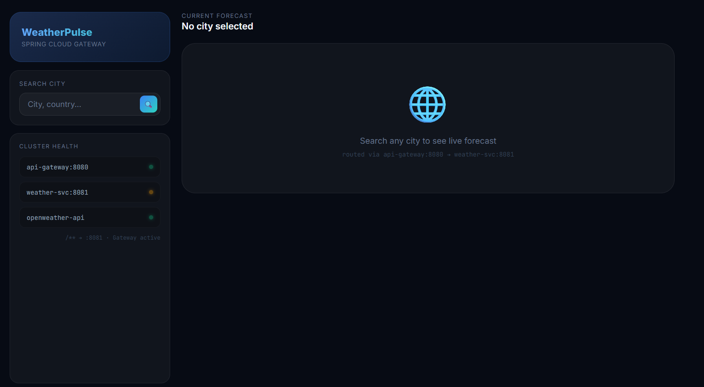
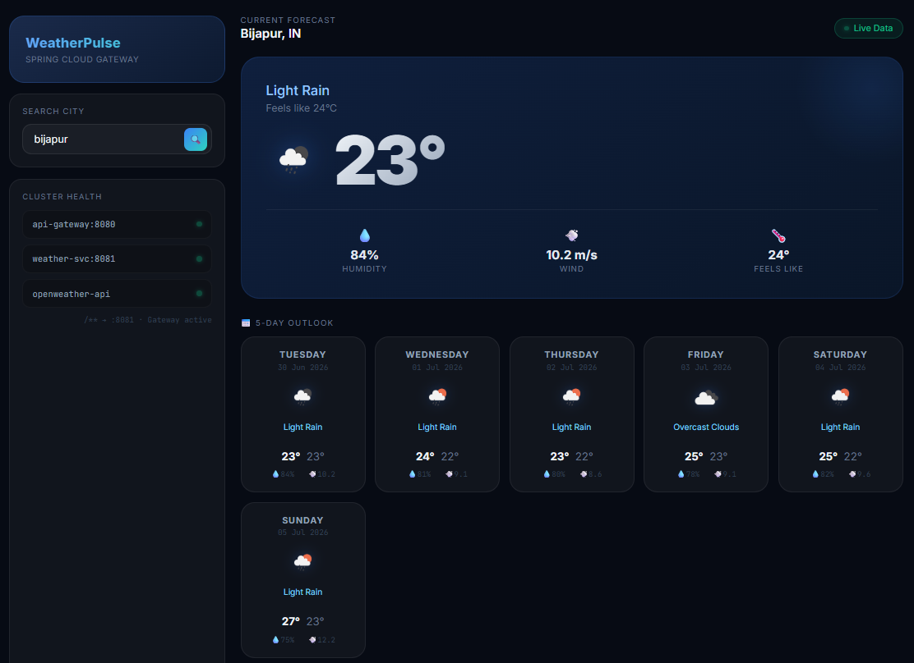
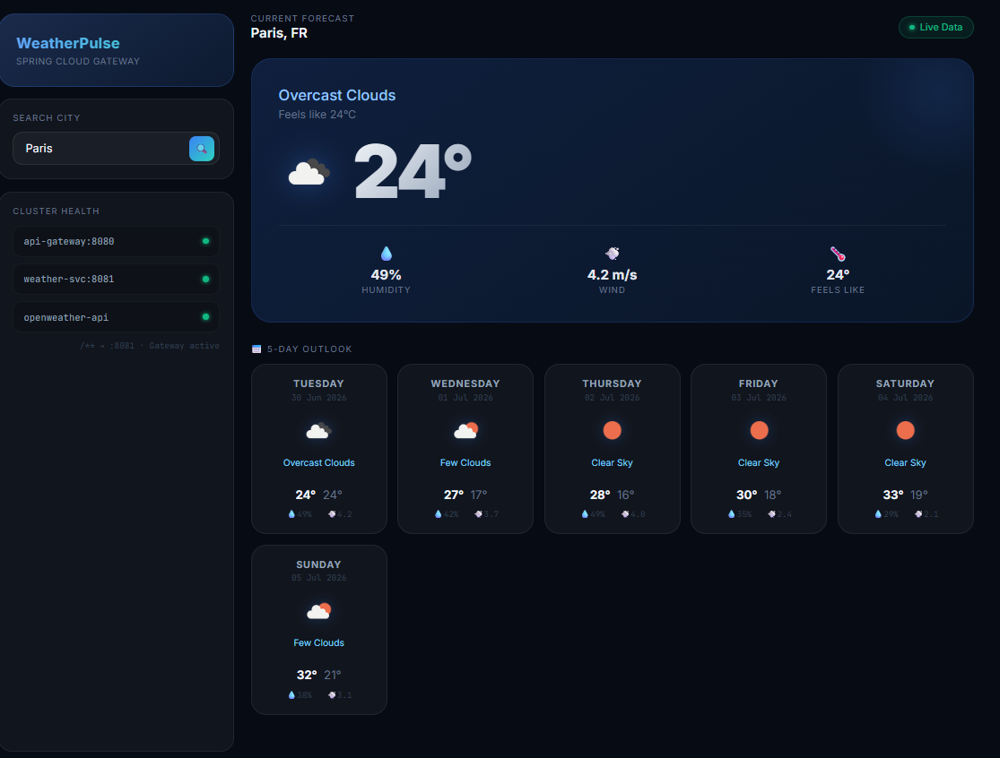

# 🌦️ WeatherPulse

A clean, full-stack weather forecast web application built with Spring Boot. Search any city in the world and get real-time conditions plus a 5-day forecast — powered by the OpenWeatherMap API.

---
Deployed on Render —https://weatherpulse-forecast.onrender.com/
---

## Screenshots

### Home Page


### Weather Forecast — India (Bijapur)


### Weather Forecast — Global (Paris)


---


## What this app does

- Search any city in the world by name
- See the current temperature and what it feels like
- View humidity percentage and wind speed
- Get a full 5-day weather forecast grouped by day
- Shows weather icons for each day
- Handles wrong city names with a friendly error message
- Falls back to cached data if the live API is temporarily unavailable

---

## Technologies I used

- **Java 21** — main programming language
- **Spring Boot 3** — backend framework
- **Spring Cloud Gateway** — routes all traffic through a single entry point
- **Thymeleaf** — frontend templating engine (like Django templates)
- **RestTemplate** — to call the OpenWeatherMap API
- **Jackson** — to map JSON response to Java objects
- **Lombok** — to write cleaner Java code without boilerplate
- **Maven** — build and dependency management
- **Docker** — containerized for easy deployment
- **OpenWeatherMap API** — real-time weather data

---

## Architecture

This project consists of **two services**:

| Service | Port | Role |
|---|---|---|
| `weatherpulse-gateway` | 8080 | Single entry point — routes all requests to the weather app |
| `weather-springboot` | 8081 | Core app — fetches weather data, processes it, renders the UI |
Browser → Gateway (8080) → Weather App (8081) → OpenWeatherMap API

The Gateway exists so the app can scale to multiple microservices later, with one place to handle routing, rate limiting, and auth.

---

## Project Structure
weather-springboot/
│
├── src/main/java/com/weather/app/
│   ├── config/
│   │   └── AppConfig.java            → RestTemplate bean
│   ├── controller/
│   │   └── WeatherController.java    → handles web requests
│   ├── dto/
│   │   ├── WeatherApiResponse.java   → maps raw JSON from API
│   │   ├── WeatherResponse.java      → final model for UI
│   │   └── DailyForecast.java        → one day forecast data
│   ├── exception/
│   │   └── WeatherException.java     → custom error handling
│   ├── service/
│   │   └── WeatherService.java       → all API logic here
│   └── WeatherAppApplication.java    → entry point
│
├── src/main/resources/
│   ├── templates/
│   │   └── index.html                → Thymeleaf UI template
│   └── application.properties        → config and API key
│
├── Dockerfile                        → multi-stage build for containerization
└── pom.xml                           → Maven dependencies
weatherpulse-gateway/
│
├── src/main/java/com/weatherpulse/weatherpulse_gateway/
│   └── WeatherpulseGatewayApplication.java → entry point
│
├── src/main/resources/
│   └── application.properties        → routing rules
│
└── pom.xml                           → Maven dependencies

---

## How to run this project locally

Make sure you have **Java 21** and **Maven** installed on your computer.

### 1. Run the Weather App

```bash
# Clone the repository
git clone https://github.com/vijayalaxmi168/Weather-Forecast.git
cd Weather-Forecast

# Add your OpenWeatherMap API key in src/main/resources/application.properties
# weather.api.key=YOUR_API_KEY_HERE


The weather app runs on 👉 **http://localhost:8081**

---

## API Used

This app uses the free [OpenWeatherMap 5-day Forecast API](https://openweathermap.org/forecast5).

It returns weather data every 3 hours for the next 5 days (40 data points total). I group all the 3-hour slots by date to show one clean card per day, calculating max/min/average temperature for each.

---

## What I learned building this

- How to structure a Spring Boot project professionally (Controller → Service → DTO pattern)
- How to call an external REST API using RestTemplate
- How to automatically map JSON to Java classes using Jackson and `@JsonProperty`
- How Thymeleaf syntax works compared to Django templates
- How Lombok reduces boilerplate with `@Data`, `@Builder`, `@Slf4j`
- How to handle exceptions properly using custom exception classes instead of returning error dicts
- How to externalize configuration using `application.properties`
- How to set up a Spring Cloud Gateway as a single entry point for microservices
- How to containerize a Spring Boot app using a multi-stage Dockerfile
- How to push a project to GitHub

---

## How this project grew

I built this during my MCA and kept improving it over time. Converting and restructuring it to Spring Boot taught me more than any tutorial ever could.

Later, I added a Spring Cloud Gateway in front of the app to learn how real microservice systems route traffic through a single entry point, and containerized the whole thing with Docker.

**Biggest lesson:** Java forces you to think before you code. Clean architecture is not optional — it is the standard.

---

## Tech Stack Summary

`Java 21` · `Spring Boot 3` · `Spring Cloud Gateway` · `Thymeleaf` · `RestTemplate` · `Jackson` · `Lombok` · `Maven` · `Docker` · `OpenWeatherMap API
